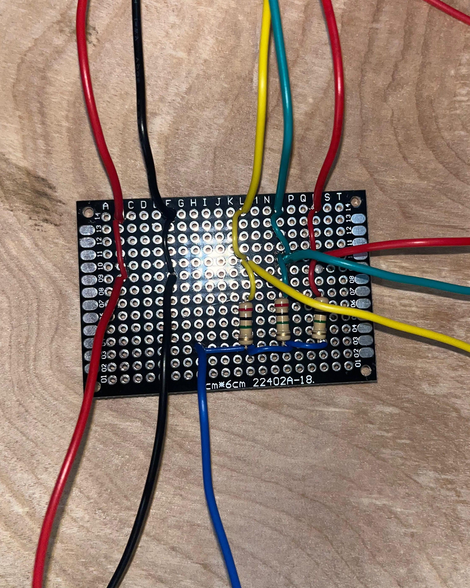
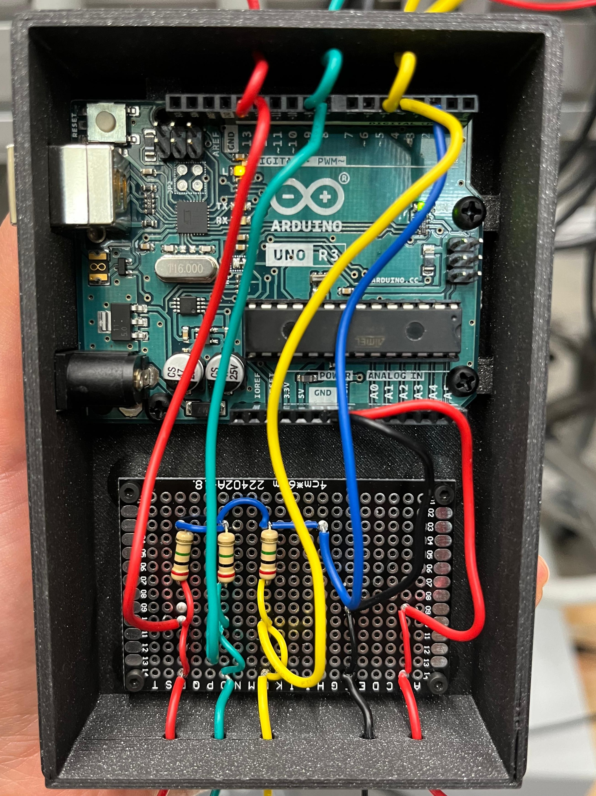
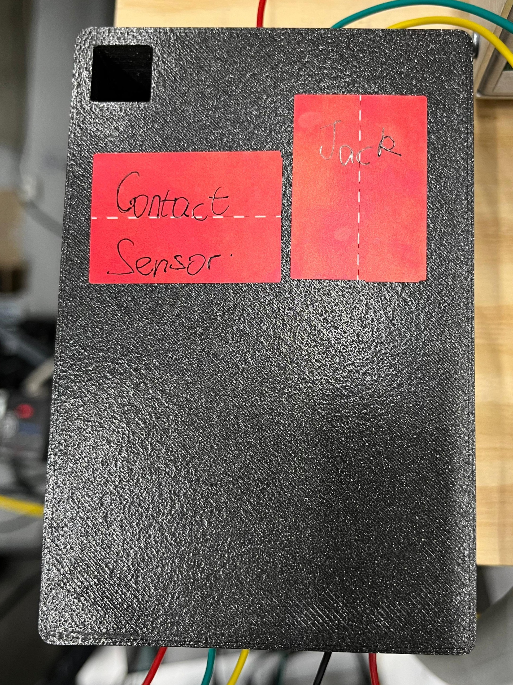
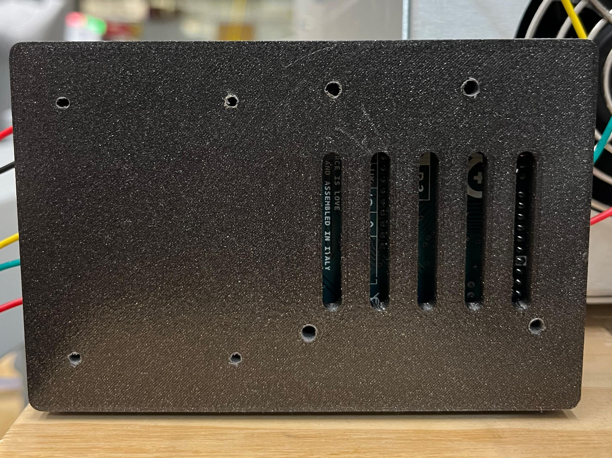
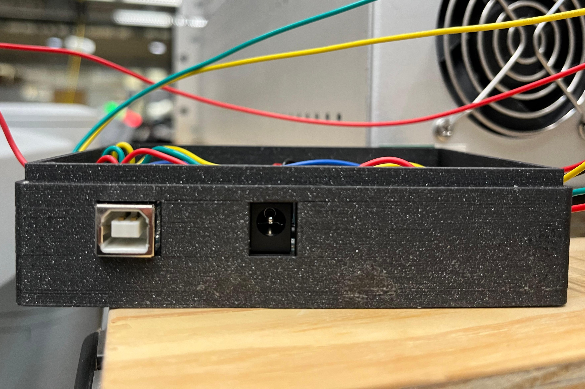

# [Contact Sensor for dVRK](https://playground.arduino.cc/Main/CapacitiveSensor/index-2.html)
This repository provides instructions to build a simple **contact detection system** for the dVRK, using capacitive sensing.

## Hardware

You will need an Arduino UNO. With a single microcontroller you can build multiple sensors; for the dVRK system you may need 3 sensors (one per PSM).  

For each sensor you need:

- Send pin
- Receive pin
- Output pin
- Resistor (100 kΩ - 10 MΩ)
- Wires (26-30 AWG and 22 AWG)

>**NOTE:** Multiple sensors can share the same *send pin*. 

### Schematics

1. Power the Arduino via USB or Vin pin (use the 12V from the [dVRK Safety Chain](https://dvrk.readthedocs.io/main/pages/setup/estop.html#)). Make sure to etabilish a common ground between the Arduino and the dVRK controller.
   
2. Place a resistor between the *send* (blue) and *receive* (yellow, green and red) pin.

3. Connect each receive pin to a wire (yellow, green, red) attached to your instrument.



Depending on the instrument type:
- **Bipolar instrument:** wrap the wire around the bipolar connector.  
- **Monopolar instrument:** insert the wire into the monopolar connector.  
- **Non-polar instrument:** insert the wire inside *flush port 1* until you reach the instrument tip.
  >**WARNING:** for non polar instrument the wire should be 26-30 AWG. Wider wires may damage your instrument!  

Finally, connect the selected output pin of the Arduino UNO to the chosen input pin of the DOF port on the dVRK controller using a [HD15 customizable connector](https://www.l-com.com/audio-video-svga-hd15-plug-for-field-termination?srsltid=AfmBOop1snolJn2_bDGoG6Q8EVFW4k9SKCYzKfEzNGiaVkPqmUy09PDH). Make sure the chosen digital input is not already used, see [dMIB IOs](https://dvrk.readthedocs.io/main/pages/configuration/dmib-io.html).

To have a more compact and portable solution you can also design a 3D-printable case.


    


### Setup

The object you want to detect contact with must have a non-negligible capacitance. Best performances are achieved with the human body, but raw meat or metal also work.  

Sensitivity depends on:
- Object’s size (larger → higher capacitance)  
- Resistor value  

*Example: for ~250 g of raw pork meat, 2 MΩ was found optimal.*  

## Software

### Arduino
1. Download the library [CapacitiveSensor](https://github.com/arduino-libraries/CapacitiveSensor/zipball/master).

2. Create as many instances of the library as the number of sensors you have.  

> **WARNING:** disable autocalibration if contacts last longer than 20s. If you want to re-enable autocalibration comment out the line `yourSensor.set_CS_AutocaL_Millis(0xFFFFFFFF);`.

3. Use the `capacitiveSensor(byte samples)` method to retrieve the sensed capacitance of the object. The `samples` parameter increases resolution (returned value is cumulative, not averaged) but slows performance.

4. Look at your output values in the final setup to tune the variable `threshold` to distinguish between contact and non-contact.  

5. The binary output will be available on the chosen `OUTPUT_PIN`.


### Configuration Files

To integrate the sensor with the dVRK, configure the IOs using an XML file and include it in the console (system) JSON file.

#### XML file

Add one line per digital input, so one per sensor. The line should look like this:

```xml
<DigitalIn BitID="2" BoardID="0" Debounce="0.001" Name="PSM1_contact" Pressed="0" Trigger="all" />
```

- **BitID:** depends on the DOF port (see [dMIB IOs reference](https://dvrk.readthedocs.io/main/pages/configuration/dmib-io.html)).  

- **BoardID:** depends on the dVRK controller (PSM, ECM, MTM) and DOF port (see [Board ID](https://dvrk.readthedocs.io/main/pages/configuration/identifiers/board-id.html)).  

- **Debounce:** in seconds (signals shorter than this are ignored).

- **Name:** ROS topic name that publishes contact state.  

  > **NOTE:** the ROS topic is an *event* so it will publish every time there is a change of state. You can look at the statistics of this type of ROS topic with `/stats/events/period_statistics`.  

- **Pressed:**  
  - `0` → active state = HIGH  
  - `1` → active state = LOW  

- **Trigger:** `"all"` for both rise and fall; otherwise `"rise"` or `"fall"`.  

*Example: in this case the system reads bit 2 of board 0, which physically corresponds to pin 7 of DOF port 3 (HOME3) on MTML controller*


#### JSON file

Modify your console (system) JSON file to include the new digital inputs. See [IOs configuration](https://dvrk.readthedocs.io/main/pages/configuration/system/io.html).  

Add in the `IOs` section a new object: `"configuration_files": ["name_of_your_file.xml"]`.  

The result should be:

```json
"IOs":
   [
     {
       "name": "IO1",
       "port": "fw",
       "protocol": "broadcast-query-read-write",
       "configuration_files": ["name_of_your_file.xml"]
     }
   ]
```

Visualize the sensor's output on the console widget, under the ``Buttons`` tab. To publish the sensor’s output as a ROS topic, start the dVRK system with `-K` (`--io-topics-read-only`).


